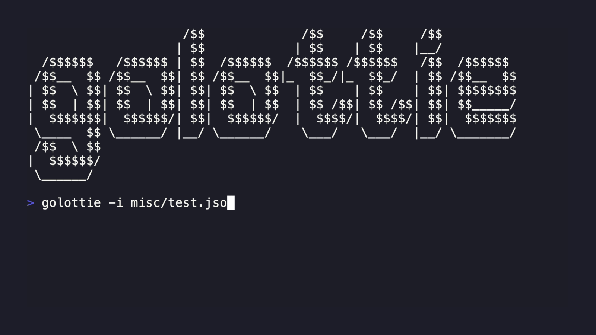

## golottie  

  
Render [Lottie](https://airbnb.design/lottie/) animations from [Bodymovin](https://aescripts.com/bodymovin/) using headless browser instance.  
> Basically a simpler [transitive-bullshit/puppeteer-lottie](https://github.com/transitive-bullshit/puppeteer-lottie) rewrite but in [GO](https://go.dev/) and with the ability to render frames concurrently  


<p align="center">
  
</p>

## Quick start 
Add the following import in your Go module

``` go
import "github.com/icyrogue/golottie"
```
Add the dependency explicitly if you need to

``` console
$ go get -u github.com/icyrogue/golottie
```

For examples checkout the [go-refernce](https://pkg.go.dev/github.com/icyrogue/golottie) and [examples](examples/) directory or just use the...

## CLI 
 
gollotie provides a simple experimental CLI to render animations localy.
It renders frames by retrieving the SVG data and converting it to PNG using [librsvg](https://github.com/GNOME/librsvg) so install it first.
``` 
Usage of golottie:

-b --bufsize	frame buffer size
		(default: 16)
-c --count	worker count (goroutines) to be created for concurrent rendering
		(default: 1)
-h --height	height of the output
		(default: 1080)
-i --input	input file name
-o --output	output sprintf pattern
-q --quiet	should I have a mouth to scream?
		(default: false)
-w --width	width of the output
		(default: 1920)
```
This CLI is proof of concept that animation can be rendered by multiple concurrent workers specified by `--count` option.  
> **Note**  
> The width and height have to be specified manually if differ from defaults.  
  
> **Warning**  
> Changes and optimizations are coming, use it if you dare!  

> The most obvious optimization is to use [memory arena](https://github.com/golang/go/issues/51317) allocation strategy  
> Rust rewrite?


